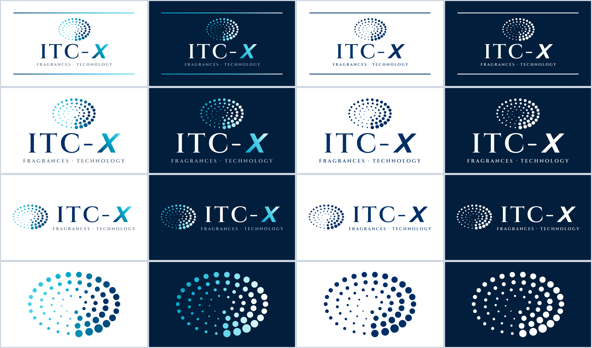

# ITC-X – Logo-Paket

Marke für edle Parfüms und exklusive Consumer-Technik. Zeichen (Punkt-Oval) und „X“ sind eigens
gezeichnet und stammen nicht aus der LogoMaker-Vorlage des ITCoreNet-Logos.

## Inhalt

| Ordner | Wofür |
|---|---|
| `svg/` | Vektordateien – beliebig skalierbar, für Web und Designer |
| `png/` | Bilddateien, 2400 Pixel breit, transparenter Hintergrund (außer „auf-dunkel“) |
| `pdf/` | Druckdateien (Vektor), 160 mm breit |

## Varianten

| Datei beginnt mit | Verwendung |
|---|---|
| `ITC-X-gestapelt` | Hauptlogo mit Verlaufsstreifen oben und unten |
| `ITC-X-gestapelt-ohne-streifen` | wenn wenig Platz ist oder die Streifen stören |
| `ITC-X-quer` | Kopfzeilen, Briefbogen, E-Mail-Signatur |
| `ITC-X-zeichen` | nur das Punkt-Oval, z. B. Profilbild, App-Symbol, Stempel |

Jeweils in vier Farbfassungen:

| Zusatz | Fassung |
|---|---|
| (ohne) | farbig auf hellem Hintergrund |
| `-auf-dunkel` | farbig auf Nachtblau (Hintergrund ist enthalten) |
| `-einfarbig-navy` | einfarbig, z. B. Stempel, Gravur, einfarbiger Druck |
| `-einfarbig-weiss` | weiß, transparent – für dunkle Fotos und Flächen |

## Farben

| Name | HEX |
|---|---|
| Navy | `#002F65` |
| Cyan | `#00A6CA` |
| Hellblau | `#4FD1E8` |
| Nachtblau (dunkler Hintergrund) | `#011E3C` |
| Grau (Unterzeile auf hell) | `#4A5D70` |

## Schrift

„ITC-“ und die Unterzeile „FRAGRANCES · TECHNOLOGY“ sind in **Cinzel SemiBold** gesetzt
(SIL Open Font License 1.1 – frei, auch gewerblich und für Logos). In den Logodateien ist die Schrift
in Pfade umgewandelt; sie muss nicht installiert sein. Für passende Texte kann Cinzel kostenlos über
Google Fonts bezogen werden.

## Hinweise

- Logo nicht verzerren und nicht umfärben – nur die vier Fassungen verwenden, rundherum Freiraum lassen.
- Unter ca. 3 cm Breite besser „quer“ oder nur das Zeichen verwenden, sonst wird die Unterzeile zu klein.
- Zwischen allen Punkten des Zeichens ist ein Mindestabstand eingehalten (nachgerechnet) – bei
  Nachbearbeitung darauf achten.
- Vor einer Markenanmeldung prüfen, ob „ITC-X“ in den betreffenden Bereichen bereits geschützt ist
  (kostenlos: DPMAregister, TMview); für die Anmeldung selbst empfiehlt sich ein Markenanwalt.

Stand: Oktober 2026
